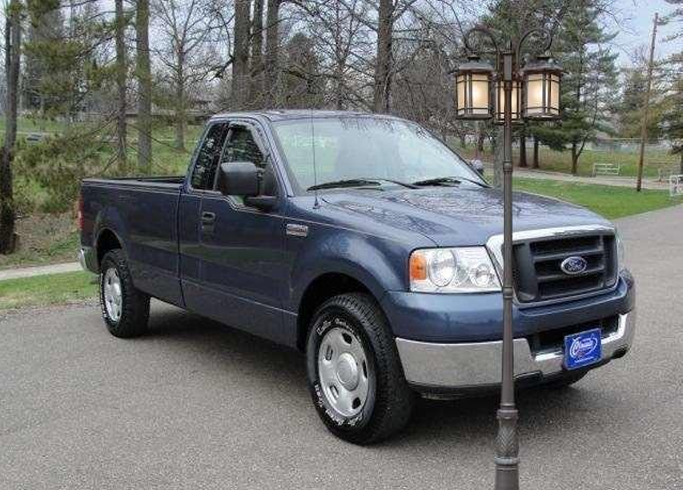
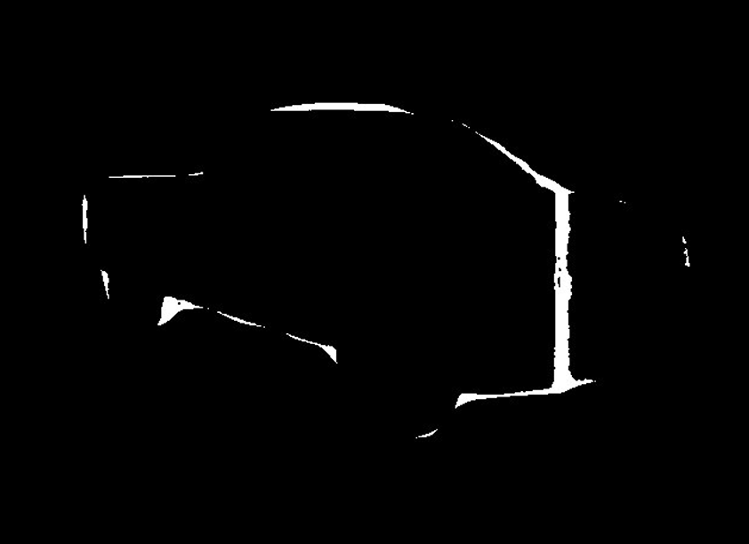
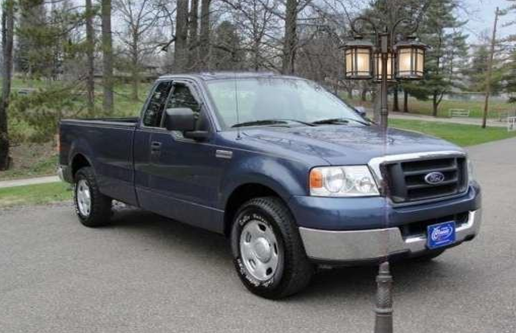

# Occluded-Object-Detection-and-Regeneration
A dual-branch pipeline for detecting and regenerating occluded vehicles. Integrates SAM 2 for modal masks and a fine-tuned Mask R-CNN for amodal segmentation, utilizing Generative Inpainting (DeepFill v2) and 6,000+ synthetic data samples for reconstruction.
## 📊 Qualitative Results
Here is a comparison of the input (occluded) vs. the output (regenerated) from the model:

| Original Occluded Image | Generated Occluder Mask | Final Regenerated Image |
| :---: | :---: | :---: |
|  |  |  |
| *Input: Car occluded by pole* | *Detected Occlusion* | *Output: Structure restored* |
