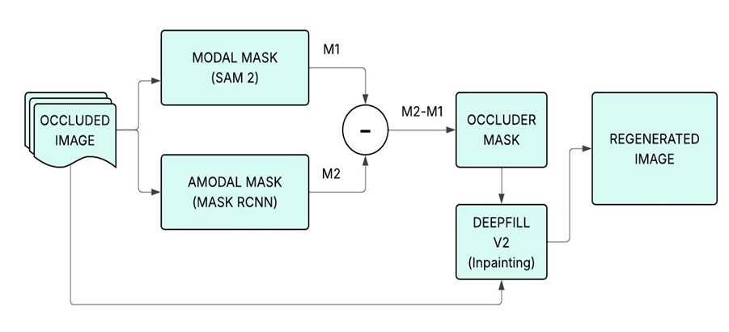
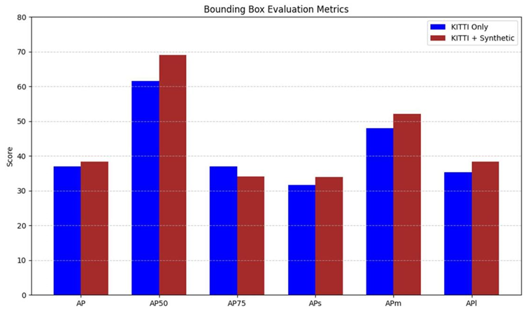
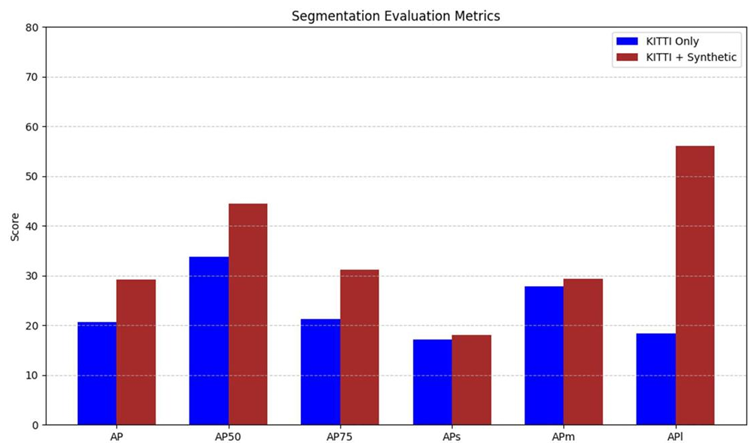

# 🚗 Occluded Object Detection & Regeneration (Amodal Perception)

## 📖 Abstract
In autonomous driving, standard object detectors only see the **visible** part of an object (Modal Perception). If a car is 50% hidden behind a truck, standard models ignore the hidden half, which is dangerous for path planning.

This project tackles **Amodal Perception**—the ability to infer the *entire* structure of an object, including occluded regions. I achieved this by engineering a **Synthetic Data Pipeline** and a multi-stage architecture combining **SAM 2** (for precision) and **Mask R-CNN** (for hallucination), followed by **DeepFill v2** for visual regeneration.

---

## ⚙️ Methodology & Workflow

My pipeline operates in three distinct stages to bridge the gap between "what we see" and "what is there.

*Figure 1: Complete System Workflow*

### 1. The Dual-Branch Segmentation
To accurately separate the "seen" from the "unseen," I employ two parallel models:
* **Modal Mask ($M_1$):** Generated by **SAM 2 (Segment Anything Model)**. This extracts the high-precision visible boundary of the object.
* **Amodal Mask ($M_2$):** Generated by a **Fine-Tuned Mask R-CNN**. I trained this model to predict the full, hallucinated shape of the car, including the parts hidden behind poles or trees.

### 2. The Synthetic Data Engine
A major challenge in Amodal Segmentation is the lack of ground truth data (humans cannot label pixels they can't see). To solve this, I developed a **Synthetic Dataset**:
* **Process:** I procedurally superimposed occluders (trees, poles, signs) onto 6,000+ clean car images.
* **Result:** This gave me perfect "Ground Truth" labels for both the visible and hidden parts of the cars, allowing the Mask R-CNN to "learn" occlusion patterns.

### 3. Regeneration (Inpainting)
Once I have the Modal ($M_1$) and Amodal ($M_2$) masks, I calculate the **Occluder Mask**:
$$\text{Mask}_{\text{occluder}} = M_2 - M_1$$
This difference mask is fed into **DeepFill v2**, which "inpaints" the missing pixels to visually reconstruct the full vehicle.

---

## 👁️ Visual Demonstration

Here is the step-by-step breakdown of how my model "sees" an invisible object.

| Stage | Visualization | Description |
| :--- | :---: | :--- |
| **1. Input** |  | The raw input image with a car partially hidden behind a lamp post. |
| **2. Modal Mask** |  | **SAM 2 Output:** Accurately segments only the *visible* pixels. |
| **3. Amodal Mask** |  | **Mask R-CNN Output:** Predicts the *full* shape of the car, inferring the missing middle section. |
| **4. Difference** |  | **Occluder Mask:** The subtraction ($M_2 - M_1$) identifies exactly *where* the object is hidden. |
| **5. Result** |  | **Regeneration:** The system "inpaints" the missing pixels to restore the full car. |

---

## 📊 Evaluation & Results

I benchmarked my model (trained on **KITTI + Synthetic Data**) against a baseline model (trained only on **KITTI**). The addition of synthetic data significantly improved the model's ability to handle complex occlusions.

### 1. Bounding Box Detection
The synthetic data improved detection accuracy across all metrics, particularly for medium-sized objects ($AP_M$).

*Table 1: Bounding Box AP comparison*

### 2. Segmentation Quality (The Critical Metric)
Since my goal is shape recovery, **Segmentation AP** is the most important metric. My approach achieved a **~40% relative improvement** in Segmentation AP ($20.72 \rightarrow 29.24$) compared to the baseline.

*Table 2: Segmentation AP comparison showing strong gains in Amodal Mask learning*

| Metric | Baseline (KITTI Only) | **Ours (KITTI + Synthetic)** | Improvement |
| :--- | :--- | :--- | :--- |
| **Segm AP** | 20.72 | **29.24** | 🟢 **+8.52**  |
| **Segm AP50** | 33.83 | **44.49** | 🟢 **+10.66** |
| **Segm APL** (Large Objects) | 18.34 | **56.05** | 🟢 **+37.71** |

> **Insight:** The massive jump in `Segm APL` (Large Objects) proves that the model successfully learned to reconstruct large vehicle shapes that are often fragmented by occlusions in the standard dataset.

---

## 🚀 Future Scope
* **Video Integration:** Leveraging temporal cues (tracking a car across frames) to generate ground truth data automatically without manual synthesis.
* **3D Scene Understanding:** Using depth estimation to handle occlusions in 3D space rather than just 2D pixels.

---
